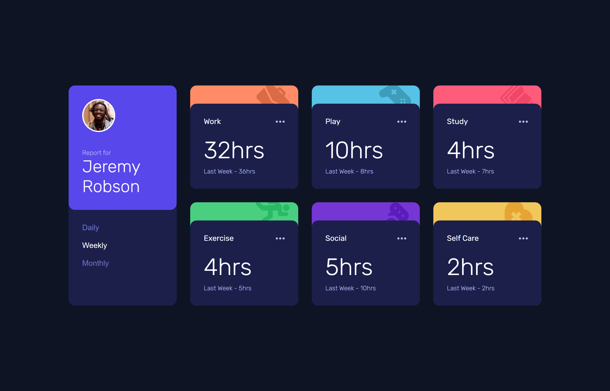
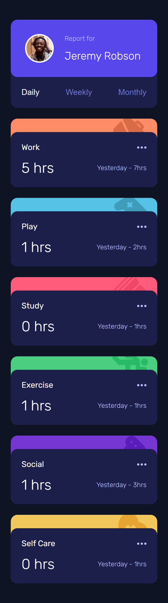
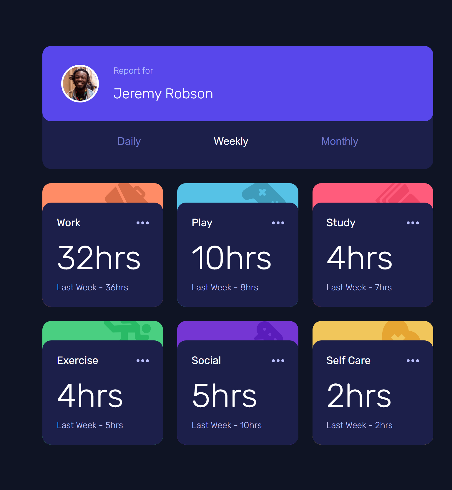

# Frontend Mentor - Time tracking dashboard


## Welcome! 👋

This is a solution to the [Time tracking dashboard challenge on Frontend Mentor](https://www.frontendmentor.io/challenges/time-tracking-dashboard-UIQ7167Jw). Frontend Mentor challenges help you improve your coding skills by building realistic projects.

## Table of contents

- [Overview](#overview)
  - [The challenge](#the-challenge)
  - [Screenshots](#screenshots)
  - [Links](#links)
- [My process](#my-process)
  - [Built with](#built-with)
  - [What I learned](#what-i-learned)
- [Author](#author)

## Overview

### The challenge

Users should be able to:

- View the optimal layout for the site depending on their device's screen size
- See hover states for all interactive elements on the page
- Switch between viewing Daily, Weekly, and Monthly stats

## 📸 Screenshots

| Desktop                        | Mobile               | Active State (Daily/Weekly/Monthly) |
| ------------------------------ | -------------------- | ---------------------- |
|  |  |  |

---

### Links

- Solution URL: [Add your solution URL here](https://www.frontendmentor.io/profile/Emelinur/solutions)
- Live Site URL: [Add your live site URL here](https://emelinur.github.io/time-tracking-dashboard-main/)

## My process

### Built with

- Semantic HTML5 markup
- CSS Custom Properties (Variables)
- CSS Grid & Flexbox
- Mobile-first workflow
- **Vanilla JavaScript**
- **Fetch API & JSON**
- Accessibility (a11y) & ARIA Attributes
### What I learned

This project was a deep dive into handling data asynchronously and manipulating the DOM dynamically. Here are my main takeaways:

#### 1. Fetching Data from JSON
Instead of hardcoding the content in HTML, I learned how to use the `fetch()` API to pull data from a local `data.json` file. This simulates how a real-world application would get data from a backend server.

```javascript
fetch('./data.json')
  .then(response => response.json())
  .then(data => {
    // Handling the data here
    updateDashboard(data);
  });
  ```
#### 2. Accessibility (a11y) & ARIA Attributes
I learned that writing functional code means writing code that works for everyone, including screen reader users.
- **Semantic HTML:** I replaced generic `div` or `img` tags with interactive `<button>` elements to ensure keyboard accessibility (Tab key navigation).
- **State Management with ARIA:** I realized that CSS classes like `.active` are only visual. To make the UI truly functional, I implemented `role="radiogroup"` and dynamically updated the `aria-checked` attribute using JavaScript. This ensures assistive technologies know exactly which timeframe is currently selected.
